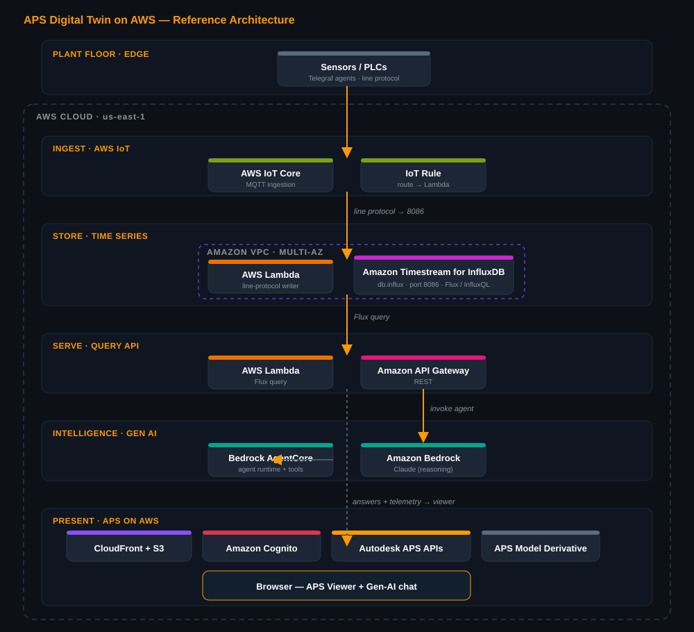

# APS Digital Twin on AWS — Autodesk University 2026

A booth demo showing how **Autodesk Platform Services (APS)** runs on **AWS**: a raw
CAD design becomes a 3D model streamed to any browser, enriched with live IoT
telemetry, deployed with natural language, and made queryable by a Gen-AI agent.



Built for a 100–400 level audience, in tiers you can walk up through:

| Tier | What it shows | Where |
|------|---------------|-------|
| **L100** | The APS pipeline: upload → translate → view a real model in the browser | [`aps-app/`](aps-app/) |
| **L200** | A **digital twin** — live sensor sprites, heatmap, 24h time-slider on the model | [`iot/`](iot/) |
| **L300** | A **Bedrock AgentCore** agent answering natural-language questions over the telemetry | [`iot/`](iot/) + [`iot/agent/`](iot/agent/) |
| **Story** | Booth narrative UI (animated model, persona switcher) | [`public/`](public/) |

📐 **Architecture diagram:** [`docs/`](docs/) — published via GitHub Pages.

## What's inside

```
aps-aws-demo/
├── aps-app/        Real, end-to-end APS Node.js app (OAuth → OSS → Model Derivative → Viewer)
│   └── deploy/     One-command AWS App Runner deploy recipe + Kiro prompt
├── iot/            L200/L300 digital twin: IoT sensor overlay + Gen-AI chat
│   └── agent/      Strands agent for Amazon Bedrock AgentCore
├── docs/           GitHub Pages site — AWS-style architecture diagram
├── public/         Booth-story UI (Three.js, persona switcher)
└── deck/           PowerPoint decks (APS-on-AWS, Built-on-Kiro)
```

## Architecture

Edge sensors → **AWS IoT Core** → **AWS Lambda** (writer) → **Amazon Timestream for
InfluxDB** (Multi-AZ VPC) → query **Lambda (Flux)** + **API Gateway** → **Amazon
Bedrock AgentCore** agent → the **APS Viewer + Gen-AI chat** in the browser
(served via **CloudFront + S3**, secured with **Amazon Cognito**). See the full
diagram: [`docs/architecture.svg`](docs/architecture.svg) (also embedded in the
GitHub Pages site [`docs/index.html`](docs/index.html)).

## Quick start

### 1. The APS viewer app (`aps-app/`)
```bash
cd aps-app
cp .env.example .env          # add APS_CLIENT_ID / APS_CLIENT_SECRET from https://aps.autodesk.com
npm install && npm start      # http://localhost:8080
```
Upload a `.stl`/`.step`/`.rvt` model; APS translates it and the viewer renders it.

### 2. The digital twin + Gen-AI chat (`iot/`)
```bash
cd iot
npm install && npm start      # http://localhost:8090
```
Scrub the 24h time slider, watch the heatmap and alarms, and click **Ask the twin**.
The chat routes to **Bedrock AgentCore** when configured, and to a built-in offline
answerer otherwise (so it always works). Deploy the agent: see
[`iot/agent/AGENTCORE.md`](iot/agent/AGENTCORE.md).

### 3. The booth-story UI (`public/`)
```bash
python3 -m http.server 8099 --bind 127.0.0.1 --directory public
```

## Deploy to AWS

The APS app ships with a one-command **AWS App Runner** recipe (build → ECR →
Secrets Manager → App Runner) and the natural-language **Kiro** prompt that
generates it — see [`aps-app/deploy/`](aps-app/deploy/).

## Prerequisites

- **Node.js 18+** for both apps.
- **APS credentials** (Client ID + Secret) from <https://aps.autodesk.com> with the
  Data Management and Model Derivative APIs enabled — needed to render real models.
- **AWS account** (+ Bedrock model access) only for the deploy and the live
  AgentCore path. The twin and its chat run locally with no AWS access.

## Notes

- The `iot/` twin's 3D scene and sensor data are **simulated stand-ins** that mirror
  the [APS Data Visualization (IoT) Extension](https://github.com/autodesk-platform-services/aps-iot-extensions-demo);
  swap the data adapter for AWS IoT + Timestream for InfluxDB to go live.
- Never commit real credentials — `.env` is gitignored; only `.env.example` is tracked.

---
*Autodesk University 2026 · Autodesk Platform Services on AWS.*
